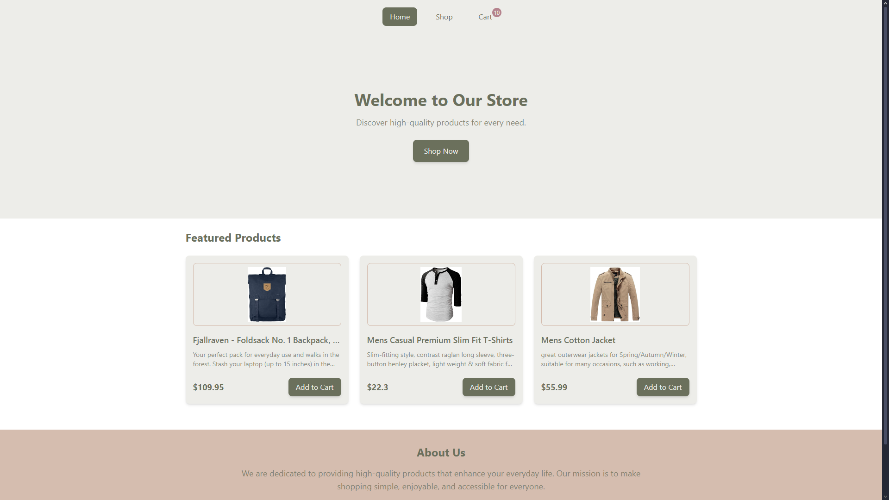
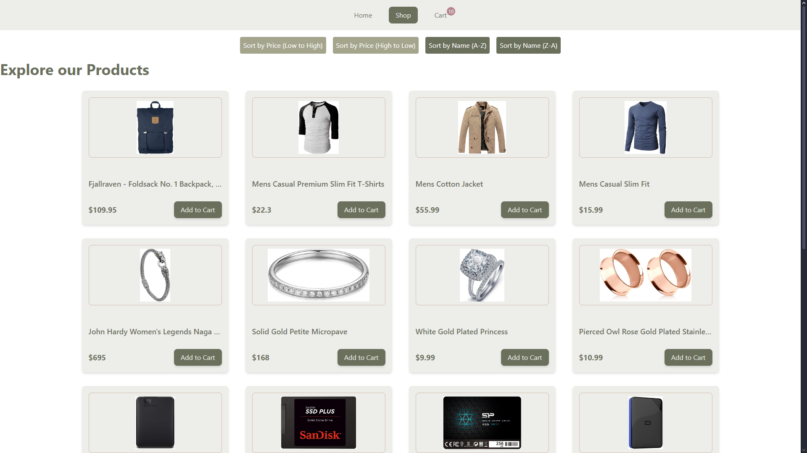
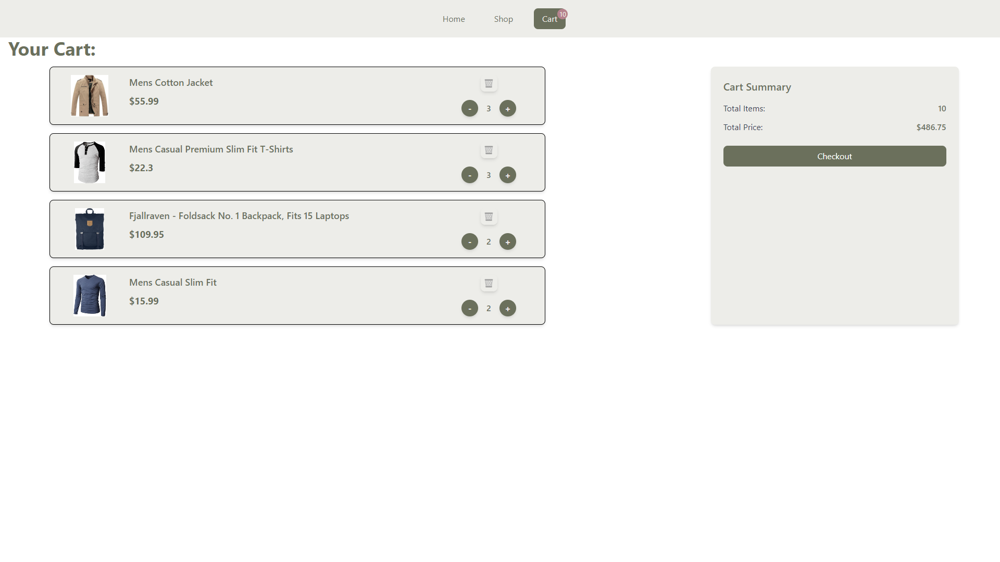

# Shopping Cart App

Try it! https://shopbypi.netlify.app

## Description

A fully functional shopping cart application built with React, TailwindCSS, and FakeStoreAPI. Users can browse products, add them to the cart, and manage their orders.

## Features

- Browse products from FakeStoreAPI.
- Add/remove products from the cart.
- Sort products by price or name.
- Responsive design for all devices.

## Technologies Used

- **React**: Front-end library for building the user interface.
- **TailwindCSS**: Utility-first CSS framework for styling.
- **React Router**: For client-side routing.
- **FakeStoreAPI**: For fetching product data.

## Usage

- **Home Page**: Browse featured products.
- **Shop Page**: View all products and add them to the cart.
- **Cart Page**: Manage your cart and proceed to checkout.

## Screenshots

## License

This project is licensed under the MIT License. See the [LICENSE](./LICENSE) file for details.

## Acknowledgments

- [FakeStoreAPI](https://fakestoreapi.com/) for providing product data.
- [TailwindCSS](https://tailwindcss.com/) for the amazing utility-first CSS framework.
